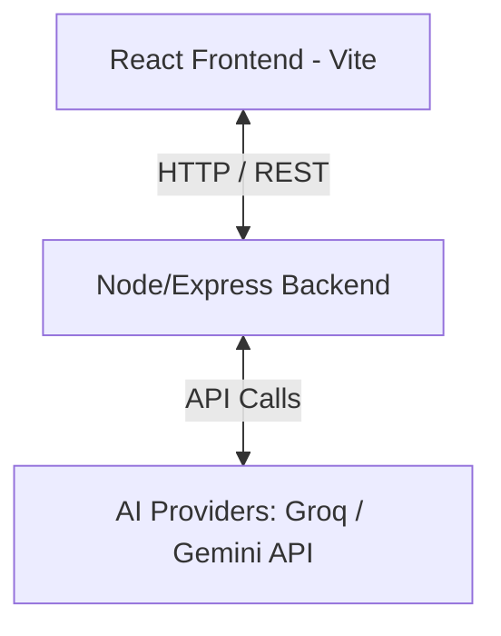

# FinTwin Project Context & Architecture

This document provides a high-level summary of the FinTwin codebase context, core modules, architecture, and developer onboarding instructions.

---

## 🧭 Project Concept

FinTwin (Financial Twin) is an interactive, design-rich financial playground designed to help users model their assets, understand their financial behaviors through personalized archetypes, and stress-test their savings against simulated real-world scenarios.

---

## 🏛️ System Architecture

FinTwin is organized as a monorepo containing a React SPA frontend and an Express backend.



### 1. Frontend (Client-side)
* **Path**: `/frontend`
* **Technologies**: React, Vite, Vanilla CSS, Recharts (for charts), Lucide React (for premium icons).
* **State Management**: Context/Store pattern for profile details, asset states, and simulations.

### 2. Backend (Server-side)
* **Path**: `/backend`
* **Technologies**: Node.js, Express, Axios, Dotenv.
* **Core API Endpoints**:
  * `/api/profile`: Financial twin personality scoring and archetype assessment.
  * `/api/simulate`: Run compounding algorithms based on returns, inflation, volatility, and major life-event expenses.
  * `/api/portfolio`: Current asset allocations and status tracker.
  * `/api/rebalance`: Suggest buy/sell operations to match target allocation benchmarks.
  * `/api/goals`: Project years-to-achievement for milestone targets.
  * `/api/insight`: AI-powered qualitative evaluations of scenarios and asset mixes.
  * `/api/tax-optimize`: Calculate potential deductions and deductions under different regimes.
  * `/api/quotes`: Access live/mock stock & mutual fund market quotes.

---

## 🤖 AI Orchestration (`claudeService.js`)

The AI engine evaluates user profiles and stream insights dynamically.
- **Provider Priority**: Checks `GROQ_API_KEY` first. If unavailable, falls back to `GEMINI_API_KEY`.
- **Mock Mode Fallback**: If keys are missing or `MOCK_AI` is set to `true`, the system gracefully degrades to locally synthesized rich JSON profiles and textual recommendations without external network latency.

---

## 📋 Standard Workflow Checklists

### Local Development Start
```bash
# Start concurrently (both backend and frontend)
npm run dev
```

### Dependency Sync
If new packages are added to subdirectories, run package installation in their respective folder:
```bash
# Backend
cd backend && npm install
# Frontend
cd frontend && npm install
```
